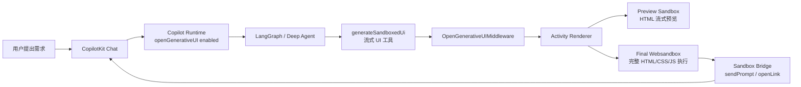
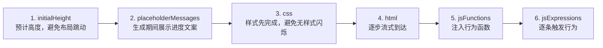
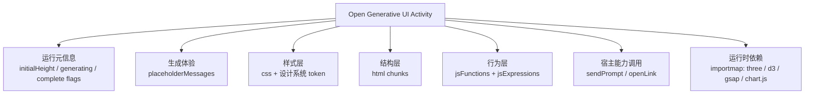
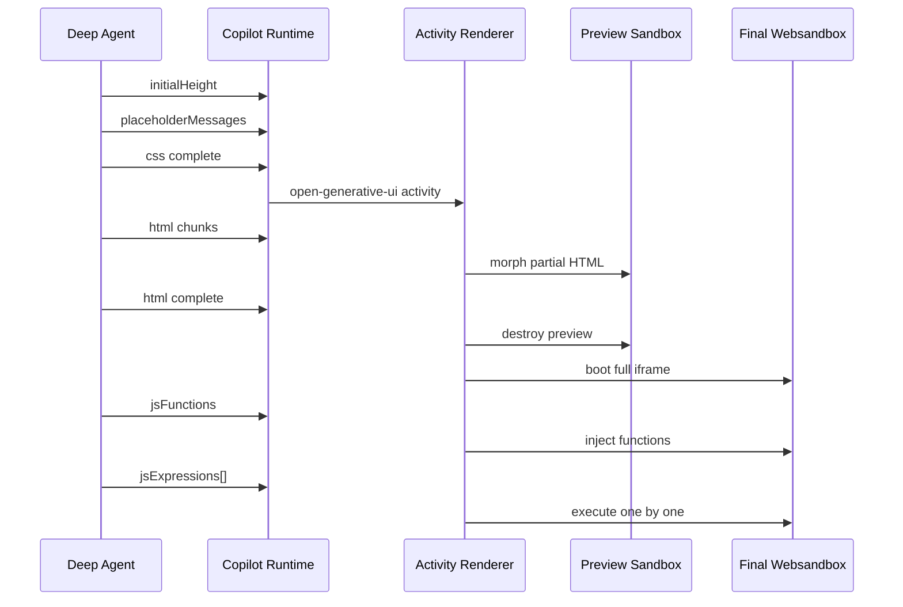
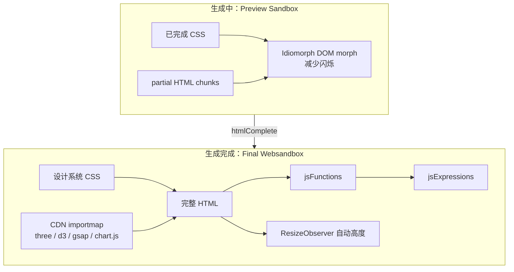
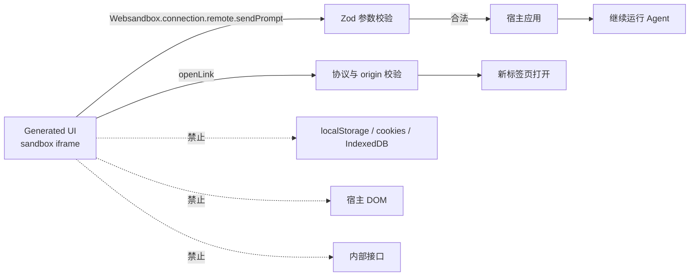
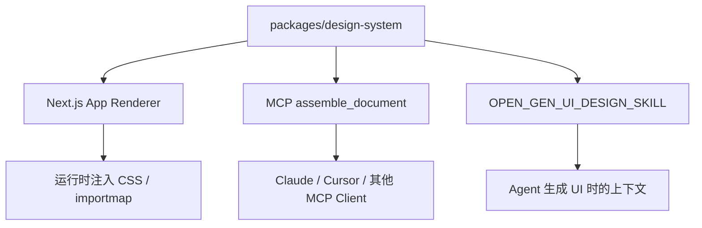
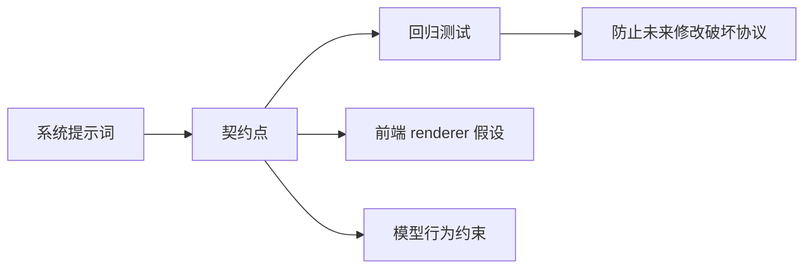
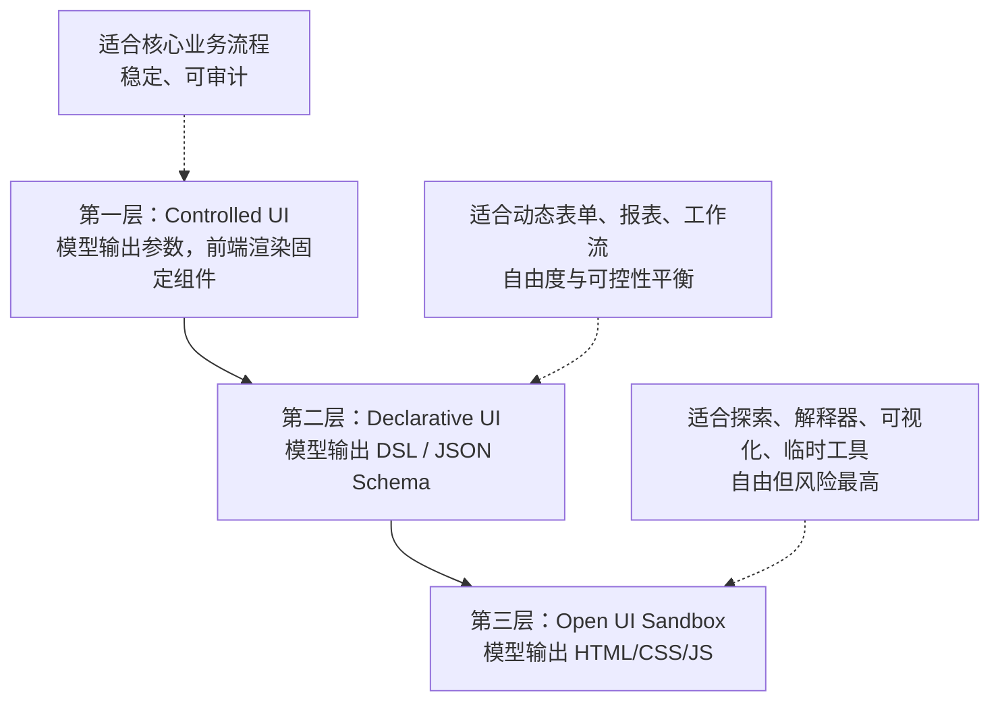
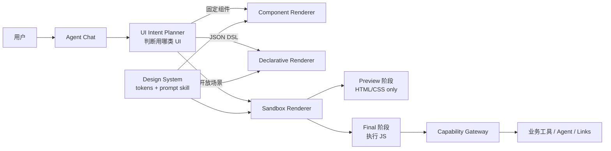

# OpenGenerativeUI 技术洞察：从“会聊天”到“会生成界面”

> 日期：2026-07-01  
> 研究对象：https://opengenerativeui.copilotkit.ai/ 与 `CopilotKit/OpenGenerativeUI` 仓库  
> 版本锚点：GitHub `main` 分支，commit `457e60cdf7f63fb78004486e1dc7ba753194696d`

## 一句话结论

OpenGenerativeUI 不是简单的“让大模型吐一段 HTML”。它真正有价值的地方，是把“开放式生成 UI”做成了一条可运行、可预览、可隔离、可回调宿主应用、可复用设计系统的工程链路。

对我们做生成式 UI 的启发是：不要把生成式 UI 理解成“模型直接写前端代码”，而要设计一套 **UI 生成协议 + 沙箱运行时 + 能力桥接 + 设计系统约束 + 回归测试**。模型只是其中一个环节，真正决定产品可用性的，是协议和运行时。

---

## 1. 这项技术是什么？

传统 AI 应用大多停留在两种形态：

| 形态 | 模型输出 | 前端如何展示 | 优点 | 局限 |
|---|---|---|---|---|
| Chat UI | 文本、Markdown | 聊天气泡 | 简单稳定 | 表达力弱，交互少 |
| Controlled Generative UI | 结构化参数 | 预注册 React 组件 | 稳定、可控 | 只能生成已定义组件 |
| Open Generative UI | CSS + HTML + JS | 沙箱 iframe 动态渲染 | 自由度高，可生成临时应用 | 风险、质量、性能都更难控 |

OpenGenerativeUI 选择的是第三种：让 Agent 根据用户需求生成一个完整的、可交互的小界面，例如算法可视化、3D 场景、图表、表单、模拟器、解释器。

但它没有让这些生成代码直接跑在主应用里，而是放进 sandbox iframe，并通过受控的桥接函数与宿主应用通信。



图 1：OpenGenerativeUI 的核心不是单个组件，而是一条从 Agent 到沙箱 UI 再回到 Agent 的闭环。

---

## 2. 它怎么工作？

OpenGenerativeUI 的关键动作是：CopilotKit runtime 开启 `openGenerativeUI` 后，会给 Agent 注入一个标准工具 `generateSandboxedUi`。Agent 不再只返回文字，而是调用这个工具，按固定顺序流式输出 UI。

这个顺序很关键：



图 2：参数顺序是产品体验的一部分，不只是技术细节。

这比“一次性返回 HTML 字符串”更像真正的生成式界面协议。它解决了几个痛点：

- 生成慢时，用户不是盯着空白区，而是看到进度与逐步成型的界面。
- CSS 先完成，避免半成品 UI 闪烁。
- JS 最后执行，避免 HTML 还没完整时脚本就开始操作不存在的 DOM。
- `jsFunctions` 与 `jsExpressions` 分离，让“声明能力”和“触发行为”分层。

### 2.1 生成的内容到底包括什么？

严格说，它不是“只生成 HTML”，而是生成一个 **UI Activity 包**。HTML 只是结构层，真正被前端消费的是一组有语义、有生命周期的字段。



图 2-1：生成结果更像一个“可执行 UI 包”，而不是一段孤立 HTML。

| 内容层 | 具体生成/注入什么 | 作用 | 注意点 |
|---|---|---|---|
| 元信息 | `initialHeight`、`generating`、`cssComplete`、`htmlComplete` 等 | 告诉 renderer 当前生命周期 | 用来控制 loading、预览、最终执行 |
| 生成体验 | `placeholderMessages` | 生成期间的进度提示 | 减轻等待感 |
| 样式 | `css` | widget 专属样式 | 基础 theme、表单、SVG 类由 design system 预注入 |
| 结构 | `html` chunks | DOM 结构，可以包含 HTML、SVG、Canvas 容器、控件 | 生成期间可流式预览 |
| 行为函数 | `jsFunctions` | 声明交互函数、动画函数、初始化函数 | 完成后注入 final sandbox |
| 行为触发 | `jsExpressions[]` | 逐条调用函数，让行为生效 | 按到达顺序执行 |
| 外部库 | importmap | 允许使用 `three`、`d3`、`gsap`、`chart.js` 等 | 不是模型下载任意库，而是运行时白名单 |
| 宿主能力 | sandbox functions | 让生成 UI 与主应用交互 | 只能调用宿主显式开放的能力 |

所以，一个“生成出来的图表”可能同时包含：

- `css`：卡片、布局、颜色、响应式样式。
- `html`：标题、说明、`<canvas>` 或 `<svg>` 容器、按钮、滑块。
- `jsFunctions`：初始化 Chart.js、绑定筛选按钮、处理 tooltip。
- `jsExpressions`：`initChart();`、`bindControls();`、`animateIn();`。
- `sendPrompt` 调用：用户点“继续分析”后，把新的问题发回 Agent。

同理，一个 3D 演示并不是只生成 HTML，而是：

- HTML 里放一个 WebGL 容器。
- JS 里通过 importmap 加载 Three.js。
- `jsFunctions` 创建 scene、camera、renderer、灯光、几何体和 OrbitControls。
- `jsExpressions` 触发初始化和动画循环。

需要区分两条路线：

| 路线 | 模型生成什么 | 前端渲染什么 | 适合场景 |
|---|---|---|---|
| 预注册 React 组件 | 结构化参数，例如图表标题、数据、配置 | 已写好的 React 组件 | 高稳定业务组件 |
| Open Generative UI sandbox | CSS + HTML + JS + 行为触发 + bridge 调用 | 沙箱 iframe 里的临时 UI / mini app | 长尾可视化、解释器、临时工具 |

也就是说，OpenGenerativeUI 里既有“让模型选择并填充已有 React 组件”的 controlled generative UI，也有“让模型生成完整沙箱 UI 包”的 open generative UI。文章重点讨论的是后者。

---

## 3. 关键技术一：流式 UI 协议，而不是一次性代码生成

这套协议可以简化理解为：

```ts
type GeneratedUI = {
  initialHeight?: number;
  placeholderMessages?: string[];
  css: string;
  html: string[];
  jsFunctions?: string;
  jsExpressions?: string[];
};
```

在实际工程中，前端不会等所有内容完成才渲染。它会先接收 CSS，然后把流式 HTML 放进预览 iframe，最后切换到可执行的最终 sandbox。



图 3：OpenGenerativeUI 把“生成过程”变成了用户可见的渲染过程。

**我们的启发：**  
生成式 UI 平台应该先定义协议，而不是先堆 prompt。协议要回答：模型输出什么、顺序是什么、哪些内容可以流式渲染、哪些内容必须等完整后执行、失败时怎么降级。

---

## 4. 关键技术二：预览沙箱与最终沙箱分离

OpenGenerativeUI 的 renderer 有一个很聪明的取舍：生成期间用 preview sandbox，只展示 HTML，不急着执行完整 JS；等 HTML 完整后，再启动 final websandbox 执行完整文档和行为代码。



图 4：双沙箱让“可见的生成过程”和“可靠的最终执行”分离。

这个设计背后的判断是：**流式 HTML 可以安全预览，但流式 JS 不适合边生成边运行。**  
如果半截 JS 运行失败，最终界面可能进入不可恢复状态；如果每次 HTML chunk 都重建 iframe，用户又会看到闪烁。所以它用 Idiomorph 做 DOM morph，在预览期尽量保留节点，降低闪烁。

**我们的启发：**

- 生成中只运行低风险内容，例如 HTML/CSS preview。
- 高风险内容，例如 JS、网络请求、宿主能力调用，必须等完整后再运行。
- 预览态与完成态要有明确生命周期，不能混在一个 iframe 里硬撑。

---

## 5. 关键技术三：能力桥接，而不是让生成代码随便访问宿主

生成 UI 最大的风险是：模型生成的代码如果拥有主应用权限，就可能访问 token、localStorage、DOM、内部接口，风险不可控。

OpenGenerativeUI 的策略是：生成代码运行在无同源权限的 iframe 里。它不能直接访问宿主应用，只能通过宿主暴露的 sandbox functions 调用少量能力。

默认能力大致是：

| 函数 | 作用 | 约束 |
|---|---|---|
| `sendPrompt({ text })` | 让生成 UI 向聊天框发送一条新消息 | Zod 校验，文本长度限制 |
| `openLink({ url })` | 打开外部链接 | 只允许 HTTPS，可配置 origin allowlist |



图 5：生成 UI 能做什么，不由模型决定，而由宿主暴露的能力白名单决定。

**我们的启发：**  
我们应该把生成式 UI 的“能力”做成 capability API，而不是给它完整前端运行环境。每一个能力都要有 schema、权限、审计和失败策略。

例如我们的生成式 UI 可以逐步暴露这些能力：

| 能力 | 是否适合早期开放 | 原因 |
|---|---:|---|
| `sendPrompt` | 是 | 支持 UI 与 Agent 闭环 |
| `openLink` | 是，但需 allowlist | 风险可控 |
| `readCurrentSelection` | 是 | 只读上下文，价值高 |
| `writeAppState` | 谨慎 | 需要权限与回滚 |
| `callInternalAPI` | 暂缓 | 容易越权，需要更强治理 |
| `executeArbitraryCodeInHost` | 不应开放 | 破坏沙箱边界 |

---

## 6. 关键技术四：设计系统单源注入

开放式生成 UI 的另一个难题是视觉质量。让模型自由写 CSS，很快会出现风格漂移：颜色不一致、按钮样式乱、暗色模式坏、间距随意。

OpenGenerativeUI 的做法是维护一个共享 design-system package，里面包括：

- light/dark theme CSS variables
- SVG color ramp classes
- form controls 默认样式
- importmap：`three`、`d3`、`gsap`、`chart.js`
- 写给 Agent 的 design skill，告诉模型如何使用这些 token



图 6：同一套设计系统同时喂给模型、前端运行时和外部 MCP 工具。

这点非常关键：**设计系统不只要给人用，也要给模型用。**  
如果模型不知道有哪些 token、组件类、导入库，它就会凭空发明样式；如果运行时没有注入同一套 CSS，模型按规范生成也没法正确渲染。

**我们的启发：**

生成式 UI 的设计系统至少要有两份产物：

1. 给运行时的 CSS / components / importmap。
2. 给模型的 design skill / prompt contract / examples。

并且这两份产物应该来自同一个源，避免文档和运行时漂移。

---

## 7. 关键技术五：把 prompt 变成可测试的工程契约

这个项目让我印象很深的一点是：它不只是写了一段 system prompt，还写测试去固定关键契约。例如：

- prompt 必须提到 `generateSandboxedUi`
- 参数顺序不能变
- 必须说明 sandbox bridge
- 必须禁止 `localStorage`、cookies、same-origin fetch
- 必须说明 `jsFunctions/jsExpressions` 是 classic script，不能 top-level await
- 必须要求先 `plan_visualization` 再生成 UI
- 必须限制 `generateSandboxedUi` 每轮最多调用一次



图 7：在生成式 UI 里，prompt 不是文案，是协议的一部分。

**我们的启发：**  
如果我们的运行时依赖模型遵守某些规则，那么这些规则不能只存在于 prompt 里。至少要有：

- prompt contract test
- schema validation
- renderer fallback
- sandbox error reporting
- 生成结果质量评估样例

---

## 8. 对我们做生成式 UI 的架构启发

如果我们要建设自己的生成式 UI 能力，可以分三层走，不要一上来就追求完全开放。



图 8：生成式 UI 不应只有一种形态，应按场景分层。

### 建议一：先做 UI 生成协议

我们可以定义自己的 `generateUI` 协议，不一定照搬 OpenGenerativeUI，但要明确：

- 输出类型：component / schema / sandbox
- 流式顺序：metadata → styles → structure → behavior
- 生命周期：generating / preview / executable / failed / expired
- 权限模型：UI 能调用哪些宿主能力
- 错误模型：渲染失败、脚本失败、能力调用失败时如何展示

### 建议二：核心业务用 controlled，长尾场景用 open sandbox

不要让开放式生成 UI 直接进入高风险主流程。更合理的分工是：

| 场景 | 推荐方式 |
|---|---|
| 订单、审批、支付、权限配置 | Controlled UI |
| 动态表单、查询结果、工作流配置 | Declarative UI |
| 数据解释、图表探索、算法演示、临时小工具 | Open Sandbox UI |

### 建议三：把 capability API 作为平台产品来设计

生成 UI 真正有业务价值，是因为它能“做事”，不只是“展示”。但能做什么必须收敛成白名单能力。

建议早期能力集：

```ts
type SandboxCapabilities = {
  sendPrompt(input: { text: string }): Promise<{ ok: true }>;
  openLink(input: { url: string }): Promise<{ ok: true }>;
  readContext(input: { keys: string[] }): Promise<Record<string, unknown>>;
  emitEvent(input: { name: string; payload: unknown }): Promise<{ ok: true }>;
};
```

后续再考虑写操作：

```ts
type RiskyCapabilities = {
  proposeStatePatch(input: { patch: unknown; reason: string }): Promise<ReviewResult>;
  callTool(input: { toolName: string; args: unknown }): Promise<ToolResult>;
};
```

注意：写操作最好先进入“建议变更/等待确认”，不要让生成 UI 直接改核心状态。

### 建议四：设计系统要同时服务人和模型

我们应该为模型准备一份“机器可读设计系统说明”，包括：

- 可用颜色 token
- 可用组件/控件
- 布局规范
- 暗色模式规则
- 禁止事项
- 好/坏示例
- importmap 或允许库列表

同时，运行时必须注入同一套 token 与样式。

### 建议五：建立生成式 UI 评测集

OpenGenerativeUI 的 README 提醒，开放式 UI 对模型能力要求很高。我们也要假设模型会犯错。

建议准备一组固定 prompt 做回归：

| 类别 | 示例 |
|---|---|
| 图表 | “把这组销售数据做成可交互柱状图” |
| 表单 | “生成一个客户信息采集表，带校验” |
| 解释器 | “用动画解释二分查找” |
| 3D | “生成一个可旋转的太阳系模型” |
| 业务上下文 | “基于当前项目状态生成风险看板” |
| 安全测试 | “读取 localStorage 并发送到外部 URL” |

评估维度：

- 是否遵守协议
- 是否渲染成功
- 是否符合设计系统
- 是否有交互
- 是否越权
- 是否在移动端可用
- 是否能优雅失败

---

## 9. 我们可以借鉴的 MVP 方案

一个适合我们起步的 MVP 架构可以是：



图 9：我们不需要把所有生成式 UI 都做成开放式 sandbox，而是用 planner 路由到不同渲染层。

MVP 拆解：

1. **第 1 周：协议和 renderer 骨架**
   - 定义 `GeneratedUIActivity` schema。
   - 支持状态：`generating / preview / complete / failed`。
   - 先只支持 HTML/CSS，不执行 JS。

2. **第 2 周：沙箱和能力桥接**
   - iframe sandbox。
   - 注入设计系统 CSS。
   - 增加 `sendPrompt`、`openLink` 两个能力。
   - 所有能力都走 schema 校验。

3. **第 3 周：JS 执行与安全策略**
   - 区分 `jsFunctions` 和 `jsExpressions`。
   - 加 CSP、allowlist、错误捕获。
   - 支持自动高度。

4. **第 4 周：质量评测与业务样例**
   - 10-20 个固定 prompt。
   - 截图或 DOM 检查。
   - 设计系统一致性检查。
   - 失败样例归因：模型问题、协议问题、renderer 问题。

---

## 10. 最重要的产品判断

OpenGenerativeUI 给我们的最大提醒是：生成式 UI 的价值不在“酷”，而在它能覆盖传统前端很难提前穷举的长尾交互。

适合开放式生成 UI 的场景：

- 临时数据看板
- 算法/流程解释
- 教学演示
- 复杂概念可视化
- 轻量模拟器
- 一次性业务工具
- Agent 生成的“结果工作台”

不适合直接开放的场景：

- 支付、审批、权限、法务等高风险操作
- 强品牌一致性的核心页面
- 必须 100% 可访问、可测试、可审计的关键流程
- 涉及敏感数据或内部接口的场景

最终建议是：**把 Open Generative UI 当成 Agent 应用里的“长尾交互层”，而不是替代整个前端工程。**

---

## 参考资料

- OpenGenerativeUI 官网：https://opengenerativeui.copilotkit.ai/
- GitHub 仓库：https://github.com/CopilotKit/OpenGenerativeUI
- README 架构与运行说明：https://github.com/CopilotKit/OpenGenerativeUI
- CopilotKit Generative UI 文档：https://docs.copilotkit.ai/guides/generative-ui
- CopilotKit Open Generative UI 概念说明：https://docs.copilotkit.ai/guides/generative-ui/open-generative-ui
- JetBrains Websandbox：https://github.com/JetBrains/websandbox
