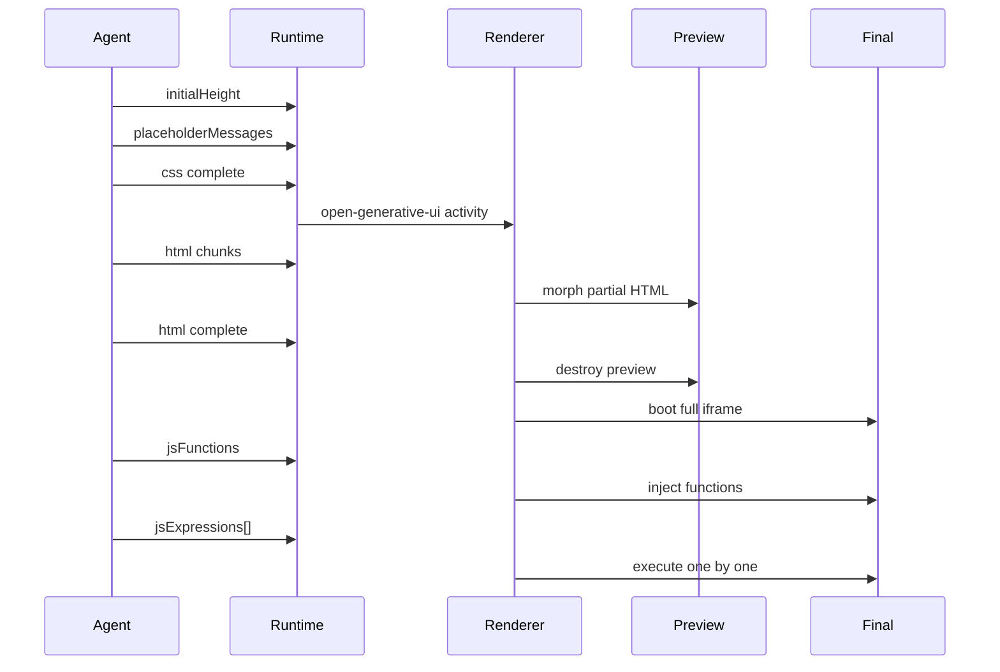
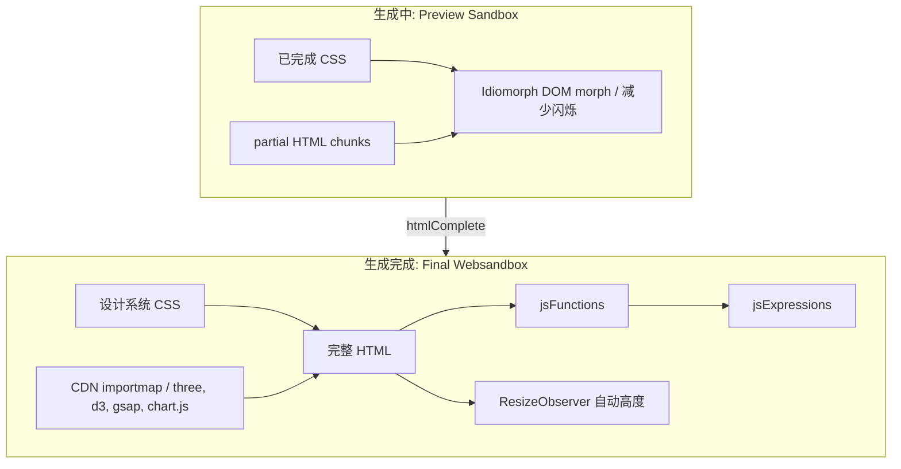
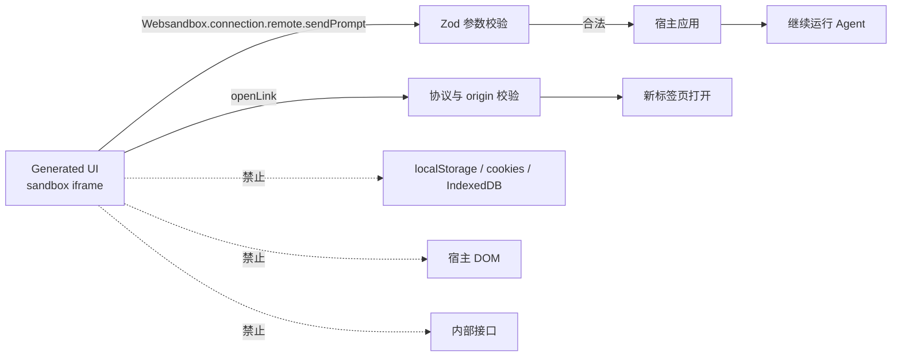
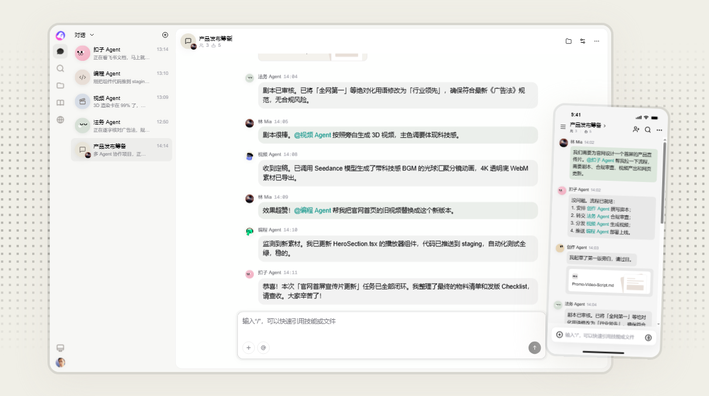
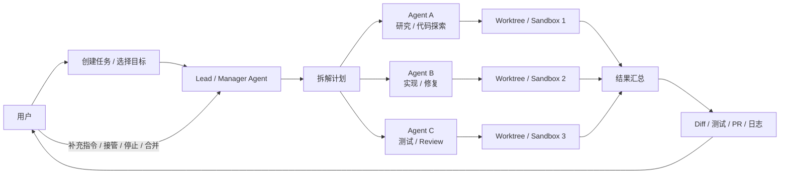
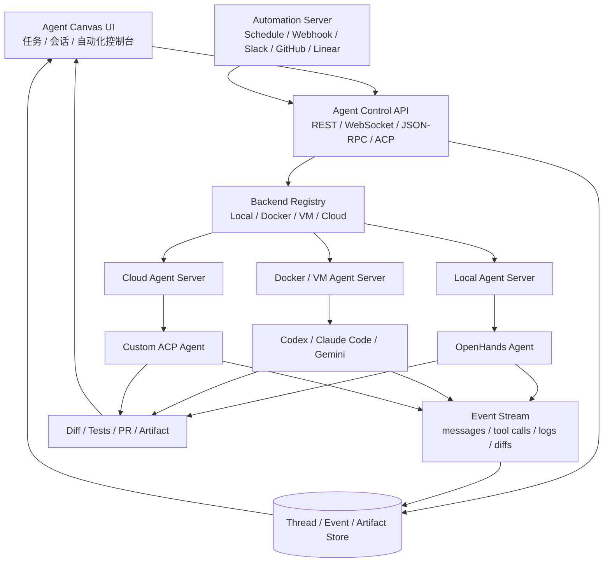

# 生成式UI

## 总结当前生成式UI趋势

生成式 UI 正在从“让模型直接写页面代码”，走向“让模型在受控协议、组件目录、工具结果或沙箱里生成界面”。核心分歧不在于能不能生成 UI，而在于：**生成物是什么、谁来渲染、能不能流式更新、交互怎么回传、风险由谁兜底**。

最重要的趋势有四个：

1. **从自由代码生成转向受控结构生成**：A2UI、json-render、OpenUI、Tambo 都不鼓励模型直接输出任意 JSX/JS，而是让模型输出 JSON、DSL、组件名和 props。
2. **组件目录成为安全边界**：宿主应用提前声明可用组件、props schema 和 action，模型只能在白名单里组合界面。
3. **流式 UI 成为基础能力**：好的生成式 UI 不是等模型完整输出后一次性渲染，而是边生成、边展示、边修正。
4. **复杂交互开始分成两条路**：业务产品倾向 A2UI/json-render/Tambo 这种可控组件路线；可视化 artifact、复杂工具界面倾向 MCP-UI/OpenGenerativeUI 这种 iframe 沙箱路线。

### 路线对比总览

| 方案 | 生成物是什么 | 渲染方式 | 最适合做什么 | 技术路线一句话 |
|---|---|---|---|---|
| [A2UI](https://github.com/a2ui-project/a2ui) | 声明式 JSON/JSONL UI 消息 | 宿主根据组件 catalog 渲染 | 类似“agent 运行时生成安全 UI”的标准协议 | 模型输出 UI 数据，宿主用自己的组件安全渲染 |
| [json-render](https://github.com/vercel-labs/json-render) | JSON UI spec | React renderer 渲染 catalog 组件 | schema 化 dashboard、表单、卡片、小应用 | 用 JSON 描述界面、状态、action 和绑定关系 |
| [OpenUI / Thesys](https://github.com/thesysdev/openui) | OpenUI Lang 流式 DSL | 逐行解析成 React UI | 数据报告、图表、表单、分析型界面 | 用更省 token 的 DSL 替代大段 JSON |
| [Tambo](https://github.com/tambo-ai/tambo) | 组件选择 + props | 真实 React 组件渲染 | 产品内 AI copilot、业务组件生成 | 把业务组件注册给 agent，让模型选择组件并填参数 |
| [Vercel AI SDK UI](https://ai-sdk.dev/docs/ai-sdk-ui/generative-user-interfaces) | tool call / tool result | 应用代码映射成 React 组件 | 稳定可靠的工具卡片和聊天 UI | 模型只调用工具，UI 由开发者显式决定 |
| [MCP-UI](https://github.com/MCP-UI-Org/mcp-ui) / MCP Apps | HTML app resource | host 用 sandbox iframe 渲染 | MCP 工具返回复杂交互界面 | 把工具结果升级成可交互小应用 |
| [OpenGenerativeUI](https://github.com/CopilotKit/OpenGenerativeUI) | HTML / CSS / JS / SVG / Canvas | sandbox iframe 渲染 | 算法可视化、3D、图表、一次性 artifact | 给模型最大表达自由，再用沙箱隔离风险 |
| [Syntux](https://github.com/puffinsoft/syntux) | React Interface Schema | 绑定数据后渲染 | 根据已有 JSON 数据自动生成展示 UI | 输入数据 value，模型生成可复用展示结构 |
| [mdocUI](https://github.com/mdocui/mdocui) | Markdown + Markdoc 组件标签 | 文本流中解析组件 | 聊天回答里插入表格、图表、按钮 | 让自然语言和交互组件混在同一条回答流里 |
| [AG-UI](https://github.com/ag-ui-protocol/ag-ui) | agent 事件流 | 不直接渲染 UI | agent 与前端同步状态、工具、消息 | 它不是 UI schema，更像承载 UI 的实时通道 |

### 关键能力矩阵

说明：**强** 表示该方案的核心能力；**中** 表示能做但不是主线；**弱** 表示需要较多自研；**无** 表示方案本身不负责。

| 能力 | A2UI | json-render | OpenUI | Tambo | AI SDK UI | MCP-UI | OpenGenerativeUI |
|---|---|---|---|---|---|---|---|
| 运行时生成 UI | 强 | 强 | 强 | 强 | 中 | 中 | 强 |
| 模型生成完整布局 | 强 | 强 | 强 | 中 | 弱 | 中 | 强 |
| 使用宿主真实组件 | 强 | 强 | 强 | 强 | 强 | 弱 | 弱 |
| 组件白名单约束 | 强 | 强 | 强 | 强 | 强 | 弱 | 弱 |
| 流式渲染 | 强 | 强 | 强 | 强 | 强 | 中 | 中 |
| 状态绑定 | 强 | 强 | 中 | 强 | 中 | 中 | 弱 |
| action / tool 回传 | 强 | 强 | 强 | 强 | 强 | 强 | 中 |
| MCP 生态 | 中 | 中 | 中 | 强 | 强 | 强 | 中 |
| 代码沙箱 | 无 | 无 | 无 | 无 | 无 | 强 | 强 |
| 安全可控 | 强 | 强 | 强 | 强 | 强 | 中 | 弱 |
| UI 表达自由度 | 中 | 中 | 中 | 中 | 弱 | 强 | 强 |
| 生产落地难度 | 中 | 中 | 中 | 低 | 低 | 中 | 高 |

### 怎么理解这些路线

| 路线 | 代表方案 | 优点 | 代价 | 一句话判断 |
|---|---|---|---|---|
| 声明式协议路线 | A2UI、json-render | 安全、可验证、能复用设计系统 | 表达力受组件 catalog 限制 | 最适合做长期平台能力 |
| DSL 路线 | OpenUI、mdocUI | 流式友好、token 成本低、适合文本混排 | 需要学习自定义语法 | 适合聊天回答、报告和数据界面 |
| 组件注册路线 | Tambo、Hashbrown | 接入 React 产品快，业务组件可复用 | 跨端和协议标准化较弱 | 最适合已有产品内嵌 AI UI |
| Tool UI 路线 | Vercel AI SDK UI | 最稳、最可控、最容易上线 | 模型不能自由设计界面 | 适合先做可靠功能，不适合追求“自动设计” |
| iframe app 路线 | MCP-UI、OpenGenerativeUI | 表达力最大，可跑复杂 Web artifact | 安全、权限、样式一致性成本高 | 适合复杂工具和可视化，不适合作为主产品 UI |
| 事件通道路线 | AG-UI | 标准化 agent 与前端交互过程 | 不直接定义 UI 长什么样 | 适合作为底层通信层，通常要搭配其他 UI schema |

### 启发

受控型输出如JSON/DSL 等路线是当前开源主流方案，建议基于OpenUI，融合其他路线的优势进一步迭代。

## OpenGenerativeUI 技术洞察：生成完整界面

能够生成完成界面，以svg，js，canvas等多种技术，展示复杂界面呈现

https://github.com/user-attachments/assets/ed28c734-e54e-4412-873f-4801da544a7f

https://github.com/user-attachments/assets/ba7db70d-07c0-49af-b221-f962f30245e2

- 算法可视化 —— 二分查找、BFS vs DFS、排序算法
- 3D 动画 —— 可交互的 WebGL / CSS3D 场景
- 图表与图解 —— 饼图、柱状图、网络图
- 交互式组件 —— 表单、模拟器、数学函数图像绘制工具

### 关键技术一：流式 UI 协议，而不是一次性代码生成

这套协议可以简化理解为：

```ts
type GeneratedUI = {
  initialHeight?: number;
  placeholderMessages?: string[];
  css: string;
  html: string[];
  jsFunctions?: string;
  jsExpressions?: string[];
};
```

在实际工程中，前端不会等所有内容完成才渲染。它会先接收 CSS，然后把流式 HTML 放进预览 iframe，最后切换到可执行的最终 sandbox。



图 3：OpenGenerativeUI 把“生成过程”变成了用户可见的渲染过程。

**我们的启发：**  
生成式 UI 平台应该先定义协议，而不是先堆 prompt。协议要回答：模型输出什么、顺序是什么、哪些内容可以流式渲染、哪些内容必须等完整后执行、失败时怎么降级。

---

### 关键技术二：预览沙箱与最终沙箱分离

OpenGenerativeUI 的 renderer 有一个很聪明的取舍：生成期间用 preview sandbox，只展示 HTML，不急着执行完整 JS；等 HTML 完整后，再启动 final websandbox 执行完整文档和行为代码。



图 4：双沙箱让“可见的生成过程”和“可靠的最终执行”分离。

这个设计背后的判断是：**流式 HTML 可以安全预览，但流式 JS 不适合边生成边运行。**  
如果半截 JS 运行失败，最终界面可能进入不可恢复状态；如果每次 HTML chunk 都重建 iframe，用户又会看到闪烁。所以它用 Idiomorph 做 DOM morph，在预览期尽量保留节点，降低闪烁。

**我们的启发：**

- 生成中只运行低风险内容，例如 HTML/CSS preview。
- 高风险内容，例如 JS、网络请求、宿主能力调用，必须等完整后再运行。
- 预览态与完成态要有明确生命周期，不能混在一个 iframe 里硬撑。

---

### 关键技术三：代码沙箱，而不是让生成代码随便访问宿主

生成 UI 最大的风险是：模型生成的代码如果拥有主应用权限，就可能访问 token、localStorage、DOM、内部接口，风险不可控。

OpenGenerativeUI 的策略是：生成代码运行在无同源权限的 iframe 里。它不能直接访问宿主应用，只能通过宿主暴露的 sandbox functions 调用少量能力。

默认能力大致是：

| 函数 | 作用 | 约束 |
|---|---|---|
| `sendPrompt({ text })` | 让生成 UI 向聊天框发送一条新消息 | Zod 校验，文本长度限制 |
| `openLink({ url })` | 打开外部链接 | 只允许 HTTPS，可配置 origin allowlist |




# 人机联动

## GPT  browser use

人机共享同一个"可见操作面"（浏览器画面）

https://images.ctfassets.net/kftzwdyauwt9/7vBVya3XA6w2Sbq74ENNIi/b65385435d060532d89225d937942e77/Agent__5_.png?fm=webp&q=90&w=3840

2. 意图可视化
浏览器画面上会叠加状态提示，告诉用户 agent 正在做什么、为什么——比如画面显示正在浏览 LinkedIn，同时有文字气泡说明"已经找到 7 个候选人，正在加入表格"。这种"每一步操作 + 自然语言旁白同步展示"是它意图可视化的核心手法，而不是单纯靠鼠标指针移动/高亮这种纯视觉隐喻（虽然底层操作确实是模拟点击、输入等动作）。
3. 人工接管（takeover mode）
这是设计上最关键的一环，随时可以点击"接管"把控制权拿回来，典型场景是登录、过验证码这类 agent 处理不了或不该处理的环节。接管期间用户的输入是隐私隔离的——ChatGPT 不会收集或存储这段时间输入的任何数据（比如密码），因为模型压根不需要看到它，不看到反而更安全。这个设计把"人工接管"和"数据边界"绑在了一起，不只是交互层面的让渡控制权，也是安全架构的一部分。 OpenAI
4. 打断与引导（steer），而非单向执行
任务执行过程中用户可以随时打断，澄清指令、把它引导向想要的结果，甚至直接改变任务；agent 会带着新信息继续之前的进度，而不是从头重来。反过来，agent 觉得信息不够时也会主动向用户提问，确保任务方向没有偏离。这是一个双向的、迭代式的协作循环，而不是"下达任务—等结果"的单轮模式。 OpenAI
5. 关键动作前的显式确权
对于发邮件、下单等有实际后果的动作，agent 会先请求用户明确许可才执行，这也是防御 prompt injection（网页里藏的恶意指令诱导 agent 做坏事）的一道关键闸门——因为要求消费性动作前有用户确认，即便攻击成功也能降低伤害范围，用户还可以随时接管或暂停来介入。


## 多Agent协同UI
核心变化是：AI 产品从“一个聊天窗口”变成“一个任务控制台”。用户把任务拆给不同 agent，agent 在各自隔离环境里并行工作，最后汇总给人 review。这里的 UI 重点不再是 prompt 输入框，而是 **任务队列、agent 状态、执行现场、上下文切换、人工介入、结果验收**。

### 产品趋势：从 Copilot 到 Agent Team

当前产品形态大致在往四个方向演进：

| 形态 | 代表产品 | UI 核心 | 本质变化 |
|---|---|---|---|
| 并行线程工作台 | [Codex App](https://developers.openai.com/codex/app/features) | 项目列表、线程列表、Local / Worktree / Cloud、diff review | 一个开发者可以同时委派多条 agent 线程 |
| Agent Sessions | [VS Code Agent Sessions](https://code.visualstudio.com/blogs/2025/11/03/unified-agent-experience) | IDE 侧边栏统一展示本地、云端、CLI、Codex 等 agent 会话 | IDE 变成 agent switchboard |
| Manager / Child Agents | [Devin](https://devin.ai/)、[Claude Code Agent Teams](https://code.claude.com/docs/en/agent-teams) | lead agent 拆任务，child / teammate agent 并行执行 | AI 开始管理 AI，人管理 lead agent |
| 自托管 Agent 控制台 | [OpenHands Agent Canvas](https://github.com/OpenHands/OpenHands)、[Open SWE](https://github.com/langchain-ai/open-swe) | 多 backend、多 sandbox、Slack / Linear / GitHub 触发、PR 回收 | agent team 能被企业接入自己的工程系统 |

[coze多Agent](https://www.coze.cn/overview?utm_source=google&utm_medium=sem&utm_term=coze_google_sem_wz_pc_zhuc_pp_coze_02&utm_campaign=22950812878&utm_content=home&utm_id=0&utm_source_platform=pc&aid=5881461794&cid=1223056945&ad_platform_id=google_offline_lead&surl_token=Nj11o&gad_source=1&gad_campaignid=22950812878&gbraid=0AAAAA-0JAbSZ40z5ntMtR-FZYCNl77Jx1&gclid=Cj0KCQjw9ZLSBhCcARIsAEhGKgPnypuopIesgd_Mx6HSnEoE8xrlTXu5QInb5ThWT6S7k8DFnNmwkm0aAhbiEALw_wcB)



VS Code 的 Agent Sessions 暴露了未来形态：一个侧边栏里能看到所有 agent session，包含 GitHub Copilot、cloud coding agent、CLI agent、OpenAI Codex 等。用户可以检查谁在跑、跑到什么状态、点击进入某个会话、在中途补充指令。这个 UI 很像“任务调度器”，而不是传统聊天产品。


Claude Code Agent Teams 和 Devin 代表的是更进一步的 “lead + teammates” 形态。Claude Code 文档把它描述为多个 Claude Code sessions 组成团队：一个 lead session 负责协调、分配、综合结果，teammates 各自有独立上下文，也可以互相通信，用户还能直接进入某个 teammate session 里干预。Devin 的产品表达也类似：一个 manager Devin 可以 spin up child sessions，把大任务拆给多个 Devin 并行推进。


OpenHands Agent Canvas 则把这个方向开源化：它自称是 coding agents and automations 的 self-hosted developer control center，可以连接本地、Docker、VM、云端等不同 agent backend，也可以运行 OpenHands、Claude Code、Codex、Gemini 或任何 ACP-compatible agent。这个产品很值得研究，因为它不是单个 agent，而是把 agent runtime、backend 管理、自动化触发和 UI 控制台合在一起。


### 交互模型：人不是操作者，而是调度者和审阅者

多 Agent 协同 UI 的用户路径可以简化成：



这类 UI 最重要的不是“多个 agent 同屏很热闹”，而是让用户始终知道：

1. **谁在做什么**：每个 agent 的角色、任务、状态、最后动作。
2. **在哪里做**：本地、云端、worktree、container、VM、浏览器环境。
3. **做出了什么**：文件 diff、命令输出、测试结果、PR、artifact。
4. **还能不能介入**：暂停、停止、追加指令、进入某个子会话、重新分配任务。
5. **结果怎么收口**：合并、丢弃、转 PR、生成报告、交给 reviewer agent。

所以多 Agent UI 的核心组件应该是：

| UI 组件 | 作用 | 设计重点 |
|---|---|---|
| Agent Session List | 展示所有 agent 线程 | 状态清晰：running / waiting / blocked / done / failed |
| Task Board | 展示任务拆分和归属 | 每个任务绑定 owner agent、进度、产物 |
| Agent Detail Pane | 展示单个 agent 的执行现场 | tool call、命令、文件、浏览器、日志可展开 |
| Workspace Switcher | 切换 local / worktree / cloud / container | 让用户理解隔离边界 |
| Review Surface | 汇总 diff、测试、PR、评论 | 人类主要在这里判断是否接受 |
| Intervention Controls | 人工介入 | stop、pause、nudge、take over、reassign、merge |

### 背后的技术趋势

多 Agent 协同 UI 背后真正的技术难点，不是“如何让多个模型同时回复”，而是 **如何把多个不确定的 agent 变成可观察、可隔离、可回滚的工程流程**。

| 技术层 | 关键问题 | 当前主流做法 |
|---|---|---|
| Orchestrator | 谁负责拆任务、派发、等待、汇总 | lead agent / manager agent / deterministic scheduler |
| Execution Runtime | agent 在哪里执行 | Git worktree、Docker、VM、云 sandbox、远程 devbox |
| Isolation | 多个 agent 怎么避免互相踩文件 | 每任务一个 worktree / sandbox / branch |
| State & Events | UI 怎么知道 agent 在干什么 | JSON-RPC、WebSocket、事件流、trace、日志订阅 |
| Human-in-the-loop | 人怎么中途介入 | plan approval、double texting、pause / stop / nudge |
| Review & Merge | 多个结果怎么收口 | diff review、PR、CI、reviewer agent、人工合并 |
| Governance | 企业怎么放心运行 | 权限、审计、凭证隔离、命令 allowlist、网络策略 |

这里有一个明显趋势：**从 agent swarm 转向 manager-worker。**  
早期多 agent 喜欢让多个 agent 互相聊天、辩论、投票，但真实产品里这很难控：成本高、上下文污染、结果不可复现。Codex、Devin、Open SWE、Claude Code Agent Teams 更接近 manager-worker / map-reduce：主 agent 负责拆解和收口，子 agent 只拿到局部任务和局部上下文，最后把结构化结果交回来。

### 开源实现方法

开源实现里最值得重点研究的是 **[OpenHands Agent Canvas](https://github.com/OpenHands/OpenHands)**。它不是一个普通 coding agent，而是一个 self-hosted developer control center：前端负责管理会话、任务和自动化；后端可以连接本地机器、Docker、VM、云端等不同 agent backend；具体 agent 可以是 OpenHands，也可以是 Claude Code、Codex、Gemini 或任何 ACP-compatible agent。

它的启发在于：如果我们想做多 Agent 协同 UI，第一步不应该是训练或发明一个新的 agent，而是先做一个 **agent 控制平面**。控制平面不关心某个 agent 内部怎么推理，它关心的是：怎么启动任务、怎么接入不同运行环境、怎么展示状态、怎么接收事件、怎么让用户介入、怎么把结果带回工程系统。

Agent Canvas 可以拆成几个关键层：

| 层 | Agent Canvas 的做法 | 对我们的启发 |
|---|---|---|
| Frontend Console | 一个统一 Web UI 管理 conversation、automation、backend | 多 agent 产品的第一屏应该是任务控制台，不是单聊天框 |
| Agent Server | REST API 管理一台机器上的多个 agent | UI 和 agent runtime 解耦，后端可以替换 |
| Backend Registry | 支持本地、Docker、VM、云端、企业基础设施 | 同一 UI 里切换不同执行环境 |
| Agent Compatibility | 支持 OpenHands、Claude Code、Codex、Gemini、ACP agent | 产品不绑定单一模型或单一 agent |
| Automation Server | 支持定时任务、Webhook、Slack / GitHub / Linear 触发 | agent 不只由人手动发起，也可以由事件驱动 |
| Sandbox Boundary | Docker / VM / remote backend 隔离执行 | 先隔离，再给 agent 足够权限 |

这套架构最适合做“Agent OS / Agent Console”的底座。它把 agent 当成 backend worker，而不是把 UI 写死在某个模型产品里。这样产品可以逐步演进：先接一个 agent，后面接多个 agent；先做人工创建任务，后面加 Slack / Linear / GitHub 触发；先本地运行，后面迁移到云端和企业环境。

如果借鉴 Agent Canvas 做一个 MVP，架构可以这样设计：



MVP 里最小闭环可以直接参考 Agent Canvas，而不是一开始做复杂 agent team 通信：

1. **任务创建**：用户输入任务，选择 repo、目标分支、运行模式。
2. **Backend 选择**：选择本地、Docker、VM 或云端 agent server。
3. **Agent 选择**：选择 OpenHands / Codex / Claude Code / 自定义 ACP agent。
4. **事件流展示**：把 agent message、tool call、命令输出、文件变更实时推到 UI。
5. **人工介入**：支持 stop、追加消息、批准计划、批准高风险命令。
6. **结果验收**：展示 diff、测试结果、artifact，支持创建 PR 或丢弃环境。

第二阶段再加真正的多 agent 协作。这个阶段可以在 Agent Canvas 的控制台上增加一个 lead agent，让它把大任务拆成多个 backend task：

```text
Lead Agent:
  - 拆任务
  - 选择 worker agent 类型
  - 选择运行 backend：local / docker / vm / cloud
  - 分配上下文、文件范围和权限
  - 等待结果
  - 做冲突检查和总结

Worker Agent:
  - 只处理局部任务
  - 在独立 backend / worktree / sandbox 执行
  - 输出结构化结果：summary、files_changed、tests_run、risks、next_steps
```

这里的关键是：Agent Canvas 负责“多 agent 的可视化和运行环境”，lead agent 负责“任务拆解和收口”，worker agent 负责“具体执行”。三层不要混在一起。worker 输出必须结构化，否则 UI 很难稳定汇总。可以要求每个 worker 结束时返回：

```ts
type AgentResult = {
  agentId: string;
  taskId: string;
  status: "done" | "blocked" | "failed";
  summary: string;
  changedFiles: string[];
  commandsRun: string[];
  tests: Array<{ command: string; status: "passed" | "failed"; outputRef?: string }>;
  risks: string[];
  suggestedNextAction: "merge" | "review" | "rerun" | "discard";
};
```

### 产品判断

多 Agent 协同 UI 的价值不在于“同时跑更多模型”，而在于把 AI 工作变成可管理的生产流程。真正有用的产品会越来越像：

- **Agent Inbox**：所有待处理、运行中、阻塞、完成的 agent 任务。
- **Agent Sessions**：每个 agent 是可进入、可观察、可打断的会话。
- **Isolated Workspaces**：每个任务有自己的 worktree / sandbox / cloud env。
- **Review-first UX**：人类主要审 diff、PR、测试和风险，而不是逐行指挥。
- **Team Integration**：任务从 Slack、Linear、GitHub、IDE 来，结果也回到这些系统。

因此，如果要押一个方向，优先研究 **Codex App 的 parallel threads + VS Code Agent Sessions 的统一会话视图 + OpenHands Agent Canvas 的自托管 backend + Open SWE 的异步 PR 流程**。这四个合起来，基本就是下一代“AI 工程队控制台”的雏形。
